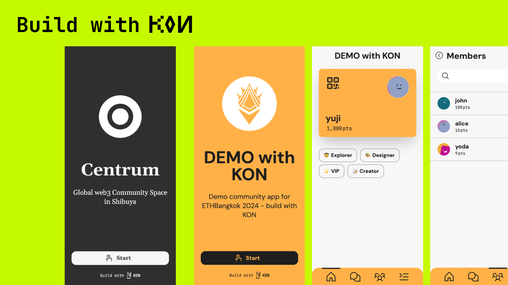
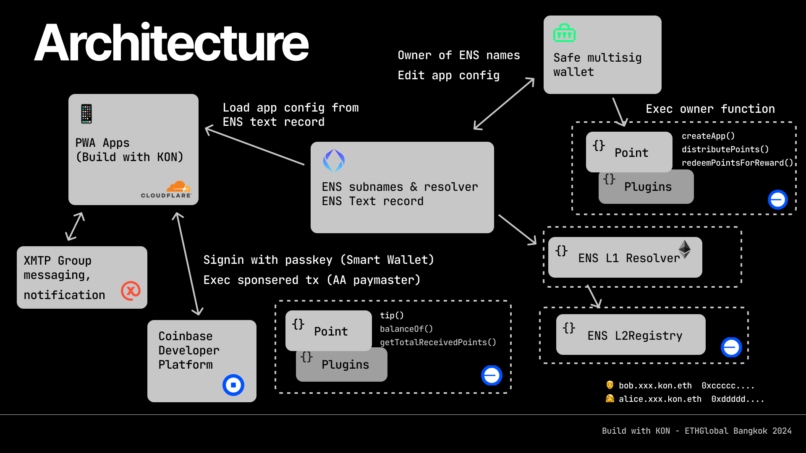

# Build with KON

> A ETHGlobal Bangkok 2024 hackathon project.

`Build with KON` simplifies launching community PWA apps, leveraging composability of web3 with ENS, Passkey wallet, XMTP.

## Conpept

`Build with KON` is a template designed to facilitate the launch of a community PWA app. Think of it as a WordPress-like solution tailored for PWA apps.

We aim to empower community owners with control over app creation and management while enhancing composability and interoperability.

With this template, owners can define app settings directly through ENS text record, allowing for seamless app deployment. Moreover, ENS records store app configuration data and its update history, ensuring transparency and traceability.

Users can log in effortlessly using their Passkey Wallets. Thanks to ENS subnames, user management becomes streamlined, enabling access to a suite of web3 functionalities without the need to manage or even be aware of a wallet.

## How it's made

- PWA app: remix on cloudflare workers, read app's config from ENS text record and launch app
- [Smart Wallets](https://www.coinbase.com/wallet/smart-wallet): Using coinbase's smartwallet, wallet creation by passkey, tx signing, and user-operated Sponsored Transactions by [CDP](https://www.coinbase.com/developer-platform)
- ENS text record: Managing app config (`app.kon` key field)
- ENS Subnames: Managing app users
- XMTP: Group creation for app users, fostering community through group chats, with bots managing app point tipping.
- Owner dashboard: We are planning to create admin dashboard for owners later, including editing page for ENS, a list of users, and create a Safe multisig for owner management.

## Architecture

## Deployment
