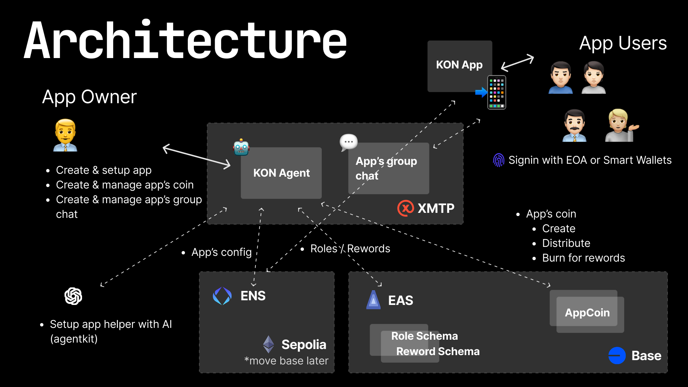

# [Base Batch Messaging Buildathon](https://base-batch-messaging.devfolio.co/) Notes

## [Project on Devfolio](https://devfolio.co/projects/kon-3d46)

## DEMOs

- A Shop app **[Wassie Coffee]**: [App](https://wassiecoffee.kon.wtf), [ENS config](https://sepolia.app.ens.domains/wassiecoffee.kon.wtf?tab=records)
- A Event app **[ETHTOKYO'25]**: [App](https://ethtokyo.kon.wtf), [ENS config](https://sepolia.app.ens.domains/ethtokyo.kon.wtf?tab=records)
- KON Agent: (Running locally) -> [Src](https://github.com/buildwithkon/kon/blob/main/packages/xmtp-agent)
  ```
  ----- 👨‍💻 Available commands -----
  ▶️ /gm
  ▶️ /app-info <appName>
  ・Get app information (e.g. /appinfo demoapp)
  ▶️ /coin-info <appName>
  ・Get app's coin information (e.g. /coin demoapp)
  ▶️ /app-setup <appName> <referenceUrl>
  ・Setup app (e.g. /app-setup demoapp https://ethtokyo.org)
    ・<appName> - ENS subnames for app (e.g. <demoapp>.kon.wtf)
    ・<referenceUrl> - official site or similar linkfor app info
  ▶️ /coin-setup <appName> <coinName> <coinSymbol>
  ・Setup app's coin (e.g. /coin-setup demoapp MYCOIN MYCOIN)
    ・<appName> - App name
    ・<coinName> - Name of coin
    ・<coinSymbol> - SYMBOL of coin
  ▶️ /coin-send <appName> <toAddress> <amount>
  ・Send app's coin (e.g. /coin-send demoapp 0x000 1)
    ・<appName> - App name
    ・<toAddress> - Address to send
    ・<amount> - Amount
  ```

> - We use `kon.xyz` for Production & Base Mainnet, and `kon.wtf` for Stating & Base Sepolia.
> - We use sepolia's default ENS resolver at the moment. We are planning to deploy Custom ENS L2 Name Registory on Base Mainnet for app registory & user regittry when go to Production.

## Architecture



## Deployments & Contracts, TXs

- **AppCoinFactory** : [Contract](https://basescan.org/address/0xab3BB37f5885a9528eC61Cf6ef7f04D327Ec798d#code)
  - Tx from XMTP Agent: [Create demoapp's coin](https://basescan.org/tx/0x1123a54f82d0caeacd86f387b8da72db8f3d593f2cfddf4bf94168333cd0afab)
- **AppCoin** : [Contract](https://basescan.org/address/0xe1310e9ba4b0ce0665834bdfdc96cf7efb68bfd5#code)
- **ENS** (spolia)
  - Tx from XMTP Agent: [Claim ENS subnames](https://sepolia.etherscan.io/tx/0xb7563578ae55fc0618d1a99dd946130e159d855613875f56a579cc96102a9034)
  - Tx from XMTP Agent: [Set ENS textRecord](https://sepolia.etherscan.io/tx/0xc0a95e0f10703d79a22f39c20250dd39e36e364eace0f92d36a115dfc625e928)
